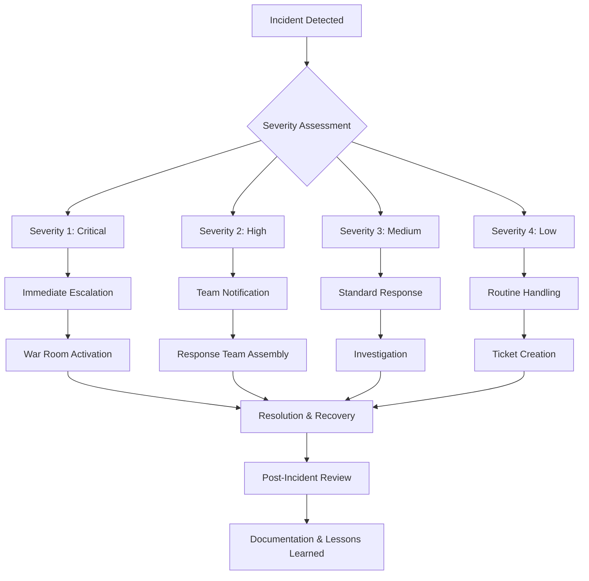

# CI/CD Pipeline and Monitoring Strategy
## XYZ Health Solutions Patient Management System

**System Features:**
- Appointment Booking with PatientID authentication
- Patient Record Access with HIPAA compliance
- Integrated billing and clinic management

---

## Part 1: CI/CD Pipeline Planning

### 1. Complete CI/CD Pipeline Stages

| **Stage** | **Type** | **Activities** | **Expected Outputs** | **Duration** |
|-----------|----------|----------------|---------------------|--------------|
| **1. Source Control** | Automated | Git commit triggers, branch protection rules, PR validation | Commit hash, branch status, PR approval | 2-5 min |
| **2. Build & Compile** | Automated | Code compilation, dependency resolution, artifact creation | Build artifacts, dependency report, build logs | 5-10 min |
| **3. Static Analysis** | Automated | Code quality checks, security scanning, HIPAA compliance validation | SonarQube report, security scan results, compliance checklist | 3-7 min |
| **4. Unit Testing** | Automated | TDD test execution, code coverage analysis, mock data validation | Test results, coverage report, performance metrics | 8-15 min |
| **5. Integration Testing** | Automated | API testing, database integration, third-party service validation | Integration test results, API response logs, DB connection status | 10-20 min |
| **6. Security Testing** | Automated | Vulnerability scanning, penetration testing, encryption validation | Security report, vulnerability list, encryption verification | 15-25 min |
| **7. HIPAA Compliance Review** | **Manual** | PHI handling validation, audit trail verification, consent management review | Compliance certificate, audit report, risk assessment | 30-60 min |
| **8. Staging Deployment** | Automated | Deploy to staging environment, smoke testing, environment validation | Deployment status, smoke test results, environment health | 5-10 min |
| **9. User Acceptance Testing** | **Manual** | BDD scenario validation, business stakeholder approval, usability testing | UAT sign-off, BDD test results, stakeholder approval | 2-4 hours |
| **10. Performance Testing** | Automated | Load testing, stress testing, appointment booking concurrency | Performance metrics, load test results, bottleneck analysis | 20-30 min |
| **11. Production Deployment** | **Manual** | Blue-green deployment, database migration, feature flag activation | Deployment confirmation, rollback plan, monitoring activation | 15-30 min |
| **12. Post-Deployment Validation** | Automated | Health checks, monitoring activation, alert configuration | System health status, monitoring dashboard, alert confirmation | 5-10 min |

### 2. CI/CD Stage Responsibilities (Plain Language)

#### **Stage 1: Source Control**
- **Who's Responsible:** Development Team
- **Who Gets Informed:** Tech Lead, Systems Analyst
- **What Happens:** "Developers save their code changes and the system automatically checks if the changes are ready for testing"

#### **Stage 2: Build & Compile**
- **Who's Responsible:** Build Engineer/DevOps
- **Who Gets Informed:** Development Team, QA Team
- **What Happens:** "The system takes all the code pieces and puts them together into a working application"

#### **Stage 3: Static Analysis**
- **Who's Responsible:** DevOps/Security Team
- **Who Gets Informed:** Systems Analyst, Security Officer
- **What Happens:** "The system checks the code for security problems and healthcare compliance issues before anyone uses it"

#### **Stage 4: Unit Testing**
- **Who's Responsible:** Development Team
- **Who Gets Informed:** QA Team, Systems Analyst
- **What Happens:** "Individual pieces of the appointment booking system are tested to make sure they work correctly"

#### **Stage 5: Integration Testing**
- **Who's Responsible:** QA Team
- **Who Gets Informed:** Systems Analyst, Technical Architect
- **What Happens:** "The system tests if all parts work together, like checking if patient records connect properly to appointment booking"

#### **Stage 6: Security Testing**
- **Who's Responsible:** Security Team
- **Who Gets Informed:** HIPAA Compliance Officer, Systems Analyst
- **What Happens:** "The system is tested for security vulnerabilities to protect patient information"

#### **Stage 7: HIPAA Compliance Review**
- **Who's Responsible:** **Systems Analyst + Compliance Officer**
- **Who Gets Informed:** Legal Team, Business Stakeholders
- **What Happens:** "Healthcare compliance experts manually review the system to ensure it meets all patient privacy laws"

#### **Stage 8: Staging Deployment**
- **Who's Responsible:** DevOps Team
- **Who Gets Informed:** QA Team, Systems Analyst
- **What Happens:** "The application is deployed to a testing environment that looks exactly like the real system"

#### **Stage 9: User Acceptance Testing**
- **Who's Responsible:** **Business Stakeholders + Systems Analyst**
- **Who Gets Informed:** Project Manager, Development Team
- **What Happens:** "Healthcare staff and patient representatives test the system to make sure it meets their needs"

#### **Stage 10: Performance Testing**
- **Who's Responsible:** Performance Team
- **Who Gets Informed:** Systems Analyst, Operations Team
- **What Happens:** "The system is tested to handle many patients booking appointments at the same time"

#### **Stage 11: Production Deployment**
- **Who's Responsible:** **Systems Analyst + DevOps Lead**
- **Who Gets Informed:** All Teams, Executive Stakeholders
- **What Happens:** "The new features are carefully released to the live system that patients actually use"

#### **Stage 12: Post-Deployment Validation**
- **Who's Responsible:** **Systems Analyst + Monitoring Team**
- **Who Gets Informed:** All Teams, On-Call Engineers
- **What Happens:** "The system is monitored to ensure everything works properly after the release"

### 3. Analyst Checkpoints Based on REQ-APPT-01 Test Plan

#### **Checkpoint 1: Unit Testing Stage (TC-001 to TC-005)**
- **Review:** Unit test logs for appointment booking validation
- **Verify:** All test cases pass with proper error messages
- **Test Cases:** TC-001 (Valid booking), TC-002 (Invalid credentials), TC-005 (Unauthorized access)
- **Action:** Validate that error messages are HIPAA-compliant and don't expose sensitive data

#### **Checkpoint 2: Security Testing Stage (TC-006 HIPAA Compliance)**
- **Review:** Security scan results and encryption validation
- **Verify:** PHI protection mechanisms are working
- **Test Cases:** TC-006 (HIPAA compliance), TC-008 (Session timeout)
- **Action:** Ensure audit trails are created and patient data is encrypted

#### **Checkpoint 3: Integration Testing Stage (TC-007 Business Logic)**
- **Review:** Integration test logs for appointment conflicts
- **Verify:** Duplicate booking prevention works correctly
- **Test Cases:** TC-007 (Duplicate prevention), TC-003 (Unavailable slots)
- **Action:** Confirm appointment booking business rules are enforced

#### **Checkpoint 4: UAT Stage (All Test Cases)**
- **Review:** Business stakeholder feedback and BDD scenario results
- **Verify:** All user scenarios work as expected
- **Test Cases:** Complete test suite validation
- **Action:** Obtain formal sign-off from healthcare staff and compliance team

#### **Checkpoint 5: Production Deployment**
- **Review:** Deployment logs and rollback procedures
- **Verify:** Zero-downtime deployment successful
- **Test Cases:** Production smoke tests based on TC-001
- **Action:** Validate monitoring and alerting systems are active

### 4. CI/CD Risks and Analyst Responses

#### **Risk 1: Failed Tests Bypassed in Production Push**
- **Scenario:** Development team skips failing security tests to meet deadline
- **Analyst Response:**
  - **Immediate:** Stop deployment and escalate to Project Manager
  - **Investigation:** Review failed test results and security implications
  - **Resolution:** Require all security tests to pass before proceeding
  - **Documentation:** Log incident for compliance audit trail

#### **Risk 2: Sensitive Patient Data Exposed in Logs**
- **Scenario:** PHI appears in application logs or error messages
- **Analyst Response:**
  - **Immediate:** Alert Security and Compliance teams
  - **Investigation:** Scan all logs for PHI exposure
  - **Resolution:** Sanitize logs and implement PHI masking
  - **Documentation:** File potential HIPAA breach report

#### **Risk 3: HIPAA Compliance Review Skipped**
- **Scenario:** Manual compliance review bypassed due to time pressure
- **Analyst Response:**
  - **Immediate:** Block production deployment
  - **Investigation:** Assess compliance risks of current build
  - **Resolution:** Complete full HIPAA review before release
  - **Documentation:** Update process to prevent future bypassing

---

## Part 2: Monitoring and Maintenance Strategy

### 1. Key Performance Metrics (5-7 Critical Metrics)

#### **Metric 1: Appointment Booking Success Rate**
- **Description:** Percentage of successful appointment bookings vs. total attempts
- **Target:** ≥ 99.5%
- **Data Source:** Application logs, database transactions
- **Business Impact:** Direct patient experience indicator

#### **Metric 2: Authentication Failure Rate**
- **Description:** Failed login attempts per PatientID (linked to TC-002, TC-005)
- **Target:** < 2% of total attempts
- **Data Source:** Authentication service logs
- **Business Impact:** Security and user experience

#### **Metric 3: System Response Time**
- **Description:** Average API response time for appointment booking
- **Target:** < 2 seconds for 95th percentile
- **Data Source:** APM tools, load balancer logs
- **Business Impact:** Patient satisfaction and system performance

#### **Metric 4: HIPAA Audit Trail Completeness**
- **Description:** Percentage of patient data access events with complete audit logs
- **Target:** 100%
- **Data Source:** Audit logging system
- **Business Impact:** Regulatory compliance and legal protection

#### **Metric 5: Security Incident Detection**
- **Description:** Unauthorized access attempts and potential breaches
- **Target:** < 0.1% of total sessions
- **Data Source:** Security monitoring, IDS/IPS systems
- **Business Impact:** Patient data protection and legal compliance

#### **Metric 6: Database Connection Health**
- **Description:** Database availability and connection pool status
- **Target:** ≥ 99.9% availability
- **Data Source:** Database monitoring, connection pool metrics
- **Business Impact:** System availability and data integrity

#### **Metric 7: Error Rate by Error Type**
- **Description:** Categorized errors (validation, business logic, system errors)
- **Target:** < 0.5% total error rate
- **Data Source:** Application error logs, exception tracking
- **Business Impact:** System reliability and user experience

### 2. Alerting Tools and Escalation Logic

#### **Alerting Tools Configuration**

| **Tool** | **Purpose** | **Alert Types** | **Integration** |
|----------|-------------|----------------|-----------------|
| **Datadog** | Infrastructure & application monitoring | Performance, availability, security metrics | Slack, PagerDuty, email |
| **PagerDuty** | Incident management and escalation | Critical system failures, security breaches | SMS, phone calls, Slack |
| **Slack** | Team communication and notifications | Non-critical alerts, deployment status | Datadog, Jira, GitHub |
| **Splunk** | Log analysis and security monitoring | HIPAA violations, audit failures | Email, PagerDuty, SIEM |

#### **Escalation Thresholds**

**🟢 LOW SEVERITY (Slack Notification)**
- Response time > 3 seconds for 5 minutes
- Authentication failure rate 2-5%
- Non-critical error rate 0.5-1%

**🟡 MEDIUM SEVERITY (Email + Slack)**
- Response time > 5 seconds for 3 minutes
- System availability < 99.5%
- Database connection issues

**🔴 HIGH SEVERITY (PagerDuty + Phone)**
- System unavailable for > 1 minute
- Security breach detected
- HIPAA compliance violation
- Patient data exposure

**🚨 CRITICAL SEVERITY (Immediate Escalation)**
- Multiple system failures
- Active security attack
- Patient safety impact
- Regulatory compliance breach

### 3. Maintenance Checklist

#### **Daily Tasks (Systems Analyst + Operations)**
- [ ] **System Health Dashboard Review** (10 minutes)
  - Check all 7 key metrics status
  - Verify backup completion
  - Review overnight alert summary
- [ ] **Security Monitoring** (15 minutes)
  - Review failed authentication attempts
  - Check for unusual access patterns
  - Validate audit log completeness
- [ ] **Performance Monitoring** (10 minutes)
  - Verify response times within targets
  - Check database performance
  - Monitor appointment booking success rates

#### **Weekly Tasks (Systems Analyst + Security Team)**
- [ ] **Compliance Review** (30 minutes)
  - HIPAA audit log analysis
  - Access control validation
  - PHI handling verification
- [ ] **Performance Trending** (20 minutes)
  - Weekly performance report generation
  - Capacity planning assessment
  - Error trend analysis
- [ ] **Security Assessment** (45 minutes)
  - Vulnerability scan review
  - Security incident analysis
  - Access privilege audit

#### **Monthly Tasks (Systems Analyst + Management)**
- [ ] **Comprehensive System Review** (2 hours)
  - Full performance analysis
  - Security posture assessment
  - Compliance status report
- [ ] **Disaster Recovery Testing** (1 hour)
  - Backup restoration validation
  - Failover procedure testing
  - Business continuity verification
- [ ] **Stakeholder Reporting** (1 hour)
  - Executive dashboard preparation
  - Patient safety metrics review
  - Regulatory compliance summary

### 4. Incident Response Workflow

#### **Severity Classification**

**SEVERITY 1: CRITICAL (Patient Safety/HIPAA)**
- **Examples:** Patient data breach, system unavailable, PHI exposure
- **Response Time:** Immediate (< 5 minutes)
- **Responders:** Systems Analyst, CISO, Legal, Executive Team
- **Communication:** PagerDuty, phone calls, emergency Slack channel

**SEVERITY 2: HIGH (System Impact)**
- **Examples:** Performance degradation, authentication failures, booking errors
- **Response Time:** < 15 minutes
- **Responders:** Systems Analyst, DevOps, Application Team
- **Communication:** PagerDuty, Slack, email to stakeholders

**SEVERITY 3: MEDIUM (Service Degradation)**
- **Examples:** Slow response times, minor errors, monitoring alerts
- **Response Time:** < 1 hour
- **Responders:** Systems Analyst, Operations Team
- **Communication:** Slack, Jira ticket, email notification

**SEVERITY 4: LOW (Minor Issues)**
- **Examples:** Log warnings, performance variations, minor bugs
- **Response Time:** < 4 hours
- **Responders:** Systems Analyst, Development Team
- **Communication:** Jira ticket, Slack notification

#### **Incident Response Process**



#### **Communication Templates**

**CRITICAL INCIDENT (Severity 1):**
```
🚨 CRITICAL INCIDENT ALERT 🚨
System: XYZ Health Solutions Patient Management
Impact: [Patient Safety/HIPAA/System Down]
Detected: [Timestamp]
Estimated Patients Affected: [Number]
Response Team: [Names and roles]
War Room: [Conference bridge/Slack channel]
Updates Every: 15 minutes
```

**HIGH SEVERITY (Severity 2):**
```
⚠️ HIGH SEVERITY INCIDENT
System: XYZ Health Solutions
Issue: [Brief description]
Impact: [User experience/performance]
Response Team: [Names]
ETA Resolution: [Estimate]
Next Update: [Timestamp]
```

#### **Post-Incident Actions**
1. **Root Cause Analysis** (Systems Analyst leads)
2. **Process Improvement** recommendations
3. **Regulatory Notification** (if required for HIPAA)
4. **Stakeholder Communication** summary
5. **Prevention Strategy** implementation
6. **Documentation Update** for runbooks

---

## Summary

This CI/CD pipeline and monitoring strategy provides comprehensive coverage for healthcare system deployment while maintaining strict compliance and patient safety standards. The multi-layered approach ensures that both technical and business requirements are met through automated validation, manual oversight, and continuous monitoring.

**Key Success Factors:**
- **Compliance First:** HIPAA requirements integrated throughout pipeline
- **Patient Safety:** Critical incidents prioritized with immediate response
- **Automated Validation:** Continuous testing reduces human error
- **Clear Accountability:** Defined roles and escalation paths
- **Comprehensive Monitoring:** Seven key metrics cover all critical aspects